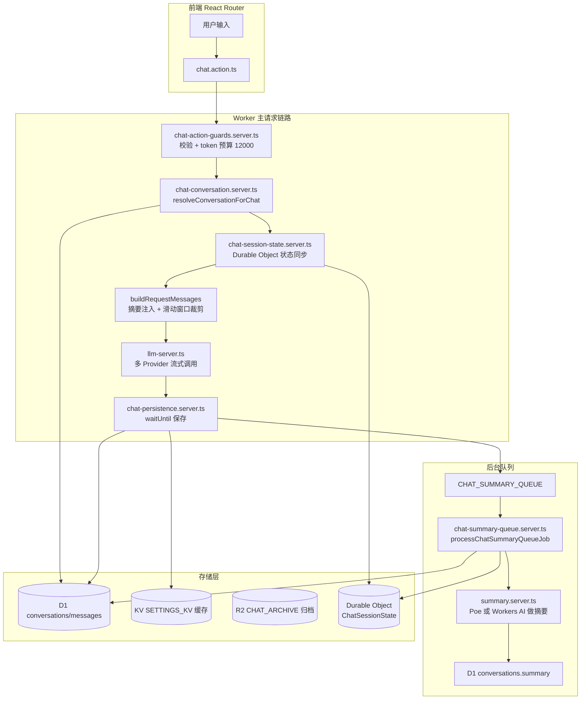
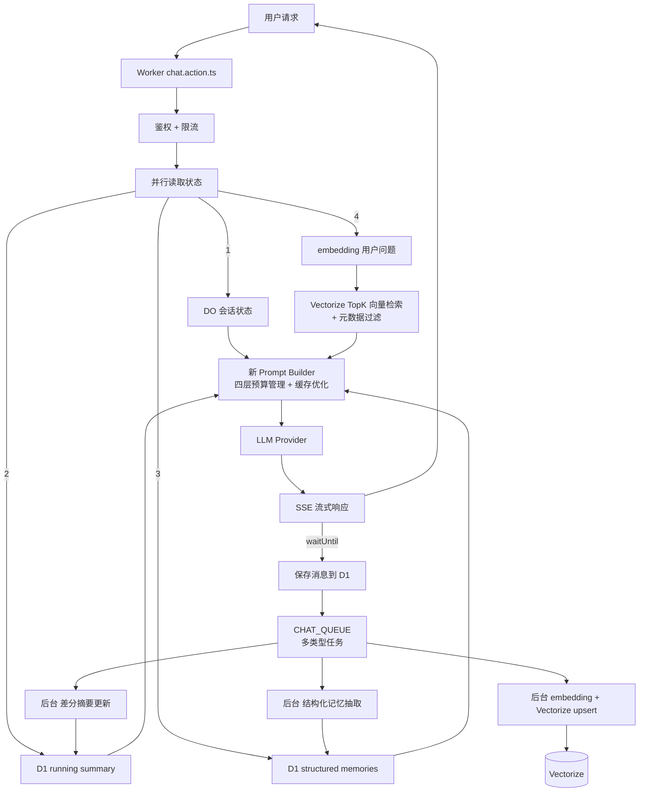
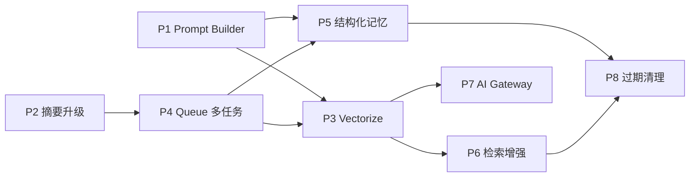

# 长上下文记忆系统重构方案——基于 Cloudflare 全栈的可执行蓝图

> **项目**: react-router-starter-template (Cloudflare Workers + D1 + R2 + Queues + Durable Objects + KV)  
> **日期**: 2026-03-17  
> **背景**: 基于 `deep-research-report.md` 的理论框架，结合项目实际代码逐文件审计后产出的定制化重构方案

---

## 1. 执行摘要

### 1.1 你当前系统做了什么

经过对你项目代码的逐文件审计，当前的长上下文管理可以精确概括为：

```
用户发消息 → chat.action.ts 收到请求
  → chat-conversation.server.ts#buildRequestMessages() 构建上下文
    → 如果有 summary，注入 system message: "以下是对话摘要..."
    → 用 summaryMessageCount 跳过已被摘要覆盖的旧消息
    → 用 trimMessagesToBudget() 按 12000 token 预算从后往前保留消息
  → 发给 LLM Provider（DeepSeek/xAI/Poe/PoloAI/Ark/Workers AI）
  → chat-persistence.server.ts 在 waitUntil 中保存消息
  → enqueueChatSummaryQueueJob() 投递到 CHAT_SUMMARY_QUEUE
  → 后台 Worker queue handler 调用 processChatSummaryQueueJob()
    → summarizeConversation() 用小模型做摘要
    → updateConversationSummary() 写回 D1
```

### 1.2 当前系统的四个核心短板

| # | 问题 | 代码位置 | 后果 |
|---|------|----------|------|
| 1 | **摘要是单份文本，但没有版本控制与可回溯性** | `summary.server.ts` 只做了 baseSummary + 新消息 → 新 summary，没有 diff 记录 | 摘要漂移不可诊断，用户无法纠错 |
| 2 | **无检索能力——记忆只有"摘要+最近消息"两层** | `buildRequestMessages()` 不做任何向量检索，只有线性的滑动窗口+摘要拼接 | 用户回溯早期细节时完全失忆 |
| 3 | **无结构化长期记忆** | 没有 preferences/constraints/open_loops 的抽取与存储 | 跨会话连续性为零，偏好每次都要重复说 |
| 4 | **Prompt 构建不利于缓存** | `buildRequestMessages()` 把摘要放最前面（每轮变化），用户消息放最后 | OpenAI/Anthropic 的 Prompt Caching 无法命中（需要精确前缀匹配） |

### 1.3 重构的核心目标

> 将"摘要+最近消息"的**两层模型**升级为**四层分级记忆 + 向量检索 + 结构化记忆 + 预算管理 + 缓存友好 Prompt 构建**的完整系统，全部基于 Cloudflare 已有服务组件实现。

---

## 2. 当前代码架构审计

### 2.1 数据流全景



### 2.2 关键文件清单与职责

| 文件 | 职责 | 重构涉及度 |
|------|------|-----------|
| `workers/app.ts` | Worker 入口，fetch handler + queue consumer + DO 类定义 | 🟡 中（新增 queue 类型、新 DO） |
| `app/lib/services/chat-conversation.server.ts` | **核心**：`buildRequestMessages()` 构建发给 LLM 的消息列表 | 🔴 高（彻底重写） |
| `app/lib/services/chat-summary-queue.server.ts` | Queue consumer：调用摘要 LLM，写回 D1 | 🔴 高（扩展为多类型任务） |
| `app/lib/llm/summary.server.ts` | 摘要 LLM 调用（Poe/Workers AI） | 🟡 中（增加差分更新 + 结构化抽取） |
| `app/lib/services/chat-persistence.server.ts` | 保存消息 + 投递摘要任务 | 🟡 中（增加 embedding 任务投递） |
| `app/lib/services/chat-action-guards.server.ts` | 请求校验 + token 预算常量 | 🟢 低（调整预算参数） |
| `app/lib/chat/context-boundary.ts` | 上下文清除边界检测 | 🟢 低（保持不变） |
| `app/lib/db/schema.sql` | D1 数据库 Schema | 🔴 高（新增多张表） |
| `app/lib/db/conversations.server.ts` | D1 CRUD 操作 | 🟡 中（新增记忆相关查询） |
| `app/lib/services/chat-session-state.shared.ts` | DO 状态类型与合并逻辑 | 🟢 低（扩展少量字段） |
| `wrangler.json` | Cloudflare binding 配置 | 🔴 高（新增 Vectorize、扩展 Queue） |

### 2.3 当前 `buildRequestMessages()` 的逻辑深度剖析

```typescript
// 文件: chat-conversation.server.ts (第 76-123 行)
// 当前逻辑伪代码：

function buildRequestMessages(options) {
    let contextMessages = options.messages;  // 前端发来的全部消息
    let summaryMessage = null;

    if (options.summary) {
        // 1) 计算从哪里开始裁剪（已被摘要覆盖的消息之后，再多保留 4 条重叠）
        const startIndex = max(0, summaryMessageCount - 4);
        const trimmed = messages.slice(startIndex);

        // 2) 把摘要变成 system message
        summaryMessage = {
            role: "system",
            content: `以下是对话摘要（用于继续上下文，不要逐字引用）：\n${summary}`
        };
        contextMessages = trimmed;
    }

    // 3) 按 12000 token 预算从后往前保留消息
    const budget = 12000 - (summaryMessage ? estimateTokens(summary) : 0);
    const trimmedMessages = trimMessagesToBudget(contextMessages, budget, 6);

    // 4) 返回：[摘要 system msg, ...最近消息]
    return summaryMessage ? [summaryMessage, ...trimmedMessages] : trimmedMessages;
}
```

**关键问题**：
- ❌ 没有系统指令(system prompt)——直接把摘要当第一条 system message
- ❌ 没有检索证据插入点
- ❌ 没有结构化记忆插入点
- ❌ 摘要放在最前面，每轮变化，导致前缀不稳定
- ❌ 硬编码 token 预算 12000，不区分模型上下文窗口大小

---

## 3. 目标架构：四层记忆 + Cloudflare 全栈实现

### 3.1 记忆分层模型

```
┌─────────────────────────────────────────────────────────────┐
│  L0 - 最近窗口 (Raw Turns)                                   │
│  ├─ 存储: 前端传入的 messages[] 最近 K 轮原文                    │
│  ├─ 特点: 高保真、零损失、每轮变化                               │
│  └─ 对应: 当前 trimMessagesToBudget() 保留的部分                │
├─────────────────────────────────────────────────────────────┤
│  L1 - 运行摘要 (Running Summary)                              │
│  ├─ 存储: D1 conversations.summary + DO 缓存                  │
│  ├─ 特点: 单份文本、差分更新、长度受控                            │
│  └─ 改进: 从"覆盖式摘要"升级为"差分 patch + 版本号"              │
├─────────────────────────────────────────────────────────────┤
│  L2 - 结构化记忆 (Structured Memory)                          │
│  ├─ 存储: D1 新表 memory_items                                │
│  ├─ 类型: preference / constraint / fact / open_loop           │
│  ├─ 特点: 可编辑、可删除、带重要性评分、跨会话有效                 │
│  └─ 新增: 需要抽取 LLM + 用户编辑 API                          │
├─────────────────────────────────────────────────────────────┤
│  L3 - 向量记忆 (Episodic Memory)                              │
│  ├─ 存储: Cloudflare Vectorize                                │
│  ├─ 特点: 对话片段 embedding、按需 TopK 召回                    │
│  └─ 新增: 需要 embedding 模型 + Vectorize binding               │
└─────────────────────────────────────────────────────────────┘
```

### 3.2 目标数据流



### 3.3 Cloudflare 组件映射

| 记忆层 | Cloudflare 服务 | 用途 | 当前状态 |
|--------|----------------|------|----------|
| L0 最近窗口 | D1 `messages` 表 | 原文存储与召回 | ✅ 已有 |
| L1 运行摘要 | D1 `conversations.summary` + DO 缓存 | 差分更新的压缩摘要 | ⚠️ 需改造 |
| L2 结构化记忆 | D1 新表 `memory_items` | 可编辑条目 | ❌ 需新建 |
| L3 向量记忆 | **Vectorize** | 语义检索 | ❌ 需新建 |
| 后台处理 | **Queues** `CHAT_SUMMARY_QUEUE` | 摘要/抽取/embedding | ⚠️ 需扩展（当前仅做摘要） |
| 会话状态 | **Durable Objects** `ChatSessionState` | 并发安全的状态管理 | ✅ 已有 |
| 缓存 | **KV** `SETTINGS_KV` | 缓存失效管理 | ✅ 已有 |
| 原文归档 | **R2** `CHAT_ARCHIVE` | 大文本/附件/归档 | ✅ 已有 |
| AI 推理 | **Workers AI** binding `AI` | 摘要/embedding 小模型 | ✅ 已有（可扩展） |

---

## 4. 详细重构方案

### 4.1 Phase 1: Prompt Builder 重写 + Token 预算管理（1-3 天）

**目标：** 控制 token、优化上下文构建顺序以利于 Prompt Caching。

#### 4.1.1 新建 `app/lib/chat/prompt-builder.ts`

这是整个重构的核心模块，替代当前 `buildRequestMessages()` 中散落的逻辑。

```typescript
// app/lib/chat/prompt-builder.ts

export interface PromptBlock {
    role: "system" | "user" | "assistant";
    content: string;
    tag: string;           // 用于调试与日志的标签
    priority: number;      // 裁剪优先级，越高越不容易被砍
    cacheable: boolean;    // 是否适合放在稳定前缀区
}

export interface PromptBuildInput {
    systemPrompt: string;
    runningSummary?: string;
    structuredMemories?: StructuredMemoryItem[];
    retrievedChunks?: string[];
    recentTurns: LLMMessage[];
    userMessage: string;
    ctxMax: number;
    outReserve: number;
}

export function buildPrompt(input: PromptBuildInput): LLMMessage[] {
    const budget = input.ctxMax - input.outReserve;
    const blocks: PromptBlock[] = [];

    // ① 固定前缀（利于 Prompt Caching）——稳定不变
    blocks.push({
        role: "system", content: input.systemPrompt,
        tag: "system_prompt", priority: 100, cacheable: true,
    });

    // ② 结构化记忆（半固定，变化频率低）
    if (input.structuredMemories?.length) {
        const memText = input.structuredMemories
            .sort((a, b) => b.importance - a.importance)
            .slice(0, 20)
            .map(m => `- [${m.kind}] ${m.text}`)
            .join("\n");
        blocks.push({
            role: "system",
            content: `【长期记忆】\n${memText}`,
            tag: "structured_memory", priority: 85, cacheable: true,
        });
    }

    // ③ 运行摘要（半固定，每轮可能 patch）
    if (input.runningSummary) {
        blocks.push({
            role: "system",
            content: `【对话摘要】\n${input.runningSummary}`,
            tag: "running_summary", priority: 80, cacheable: false,
        });
    }

    // ④ 向量检索证据（动态）
    if (input.retrievedChunks?.length) {
        const deduped = [...new Set(input.retrievedChunks)].slice(0, 8);
        blocks.push({
            role: "system",
            content: `【相关上下文】\n${deduped.map((c, i) => `(${i+1}) ${c}`).join("\n\n")}`,
            tag: "retrieved_context", priority: 70, cacheable: false,
        });
    }

    // ⑤ 最近对话窗口（动态，靠近末尾以缓解 lost-in-the-middle）
    for (const turn of input.recentTurns) {
        blocks.push({
            role: turn.role, content: turn.content,
            tag: "recent_turn", priority: 60, cacheable: false,
        });
    }

    // ⑥ 用户当前输入（必须保留，最高优先级）
    blocks.push({
        role: "user", content: input.userMessage,
        tag: "user_input", priority: 1000, cacheable: false,
    });

    // Token 预算裁剪
    return applyTokenBudget(blocks, budget);
}
```

**设计要点：**
- **稳定前缀优先**: system_prompt → structured_memory 是最稳定的，放最前面
- **Lost-in-the-middle 优化**: 关键信息在开头（系统指令+记忆）和结尾（用户输入），摘要和检索在中间
- **优先级裁剪**: 预算不够时从低优先级开始砍（向量检索 > 摘要 > 最近对话中较早的轮次）

#### 4.1.2 修改 `chat-conversation.server.ts`

将 `buildRequestMessages()` 改为调用新的 `buildPrompt()`，增加模型上下文窗口感知：

```typescript
// 新增：模型上下文窗口映射
const MODEL_CTX_LIMITS: Record<string, number> = {
    "grok-4-1-fast-reasoning": 128000,
    "claude-sonnet-4-5-20250929-thinking": 200000,
    "deepseek-chat": 64000,
    "deepseek-reasoner": 64000,
    // ...其他模型
};

// 替代硬编码的 12000
function getPromptBudget(model: string) {
    const ctxMax = MODEL_CTX_LIMITS[model] ?? 32000;
    return { ctxMax, outReserve: Math.min(4096, Math.floor(ctxMax * 0.15)) };
}
```

#### 4.1.3 增加系统指令

当前系统**没有 system prompt**。需要新增一个可配置的系统指令：

```typescript
// app/lib/chat/system-prompts.ts
export const DEFAULT_SYSTEM_PROMPT = [
    "你是一个博学且严谨的 AI 助手。",
    "",
    "规则：",
    "1. 回答必须基于证据，必要时说明不确定性。",
    "2. 如果提供了【长期记忆】，使用其中的偏好和约束来调整回答风格。",
    "3. 如果提供了【对话摘要】和【相关上下文】，参考它们但不要逐字引用。",
    "4. 优先使用中文回答。",
].join("\n");
```

---

### 4.2 Phase 2: 摘要系统升级——差分更新 + 版本控制（2-3 天）

**目标：** 将摘要从"覆盖式"改为"差分 patch + 版本追踪"，支持漂移诊断。

#### 4.2.1 数据库 Schema 变更

```sql
-- 新增迁移: 0004_summary_versioning.sql

-- 摘要版本历史（用于回溯与诊断）
CREATE TABLE IF NOT EXISTS summary_versions (
    id INTEGER PRIMARY KEY AUTOINCREMENT,
    conversation_id TEXT NOT NULL,
    user_id TEXT NOT NULL,
    version INTEGER NOT NULL,
    summary_text TEXT NOT NULL,
    source_turn_range TEXT,          -- JSON: { from: turnId, to: turnId }
    change_description TEXT,         -- LLM 生成的变更说明
    created_at INTEGER NOT NULL,
    FOREIGN KEY (conversation_id) REFERENCES conversations(id) ON DELETE CASCADE
);

CREATE INDEX IF NOT EXISTS idx_summary_versions_conv
    ON summary_versions(conversation_id, version DESC);
```

#### 4.2.2 升级 `summary.server.ts`

```typescript
// 差分更新 prompt 模板
const DIFF_SUMMARY_PROMPT = `你是对话记忆管理器。你的任务是更新一份运行摘要。

当前摘要（版本 {version}）：
{currentSummary}

新增对话内容：
{newTranscript}

要求：
1. 基于当前摘要和新增内容，输出更新后的完整摘要
2. 保持固定格式：核心事实 / 用户偏好 / 约束限制 / 已做决定 / 未完成事项
3. 摘要总长度控制在 800 字以内
4. 合并重复信息，删除已不相关的内容
5. 额外输出一行变更说明

输出 JSON 格式：
{ "summary": "...", "changeDescription": "..." }`;
```

**与当前实现的差异：**
- 当前：每次把 baseSummary + newMessages 拼给模型，输出纯文本
- 新方案：带版本号的差分更新，输出 JSON（含变更说明），旧版本存到 `summary_versions` 表

---

### 4.3 Phase 3: 结构化记忆 L2（1-2 周）

**目标：** 自动抽取用户偏好/约束/事实/待办，形成可编辑的长期记忆条目。

#### 4.3.1 数据库 Schema

```sql
-- 新增迁移: 0005_structured_memory.sql

CREATE TABLE IF NOT EXISTS memory_items (
    id TEXT PRIMARY KEY,
    user_id TEXT NOT NULL,
    conversation_id TEXT,
    project_id TEXT,
    kind TEXT NOT NULL,     -- 'preference' | 'constraint' | 'fact' | 'open_loop'
    content TEXT NOT NULL,
    importance REAL NOT NULL DEFAULT 0.5,
    source_turn_ids TEXT,   -- JSON array
    is_active INTEGER NOT NULL DEFAULT 1,
    created_at INTEGER NOT NULL,
    updated_at INTEGER NOT NULL,
    expires_at INTEGER
);

CREATE INDEX IF NOT EXISTS idx_memory_items_user
    ON memory_items(user_id, is_active);
CREATE INDEX IF NOT EXISTS idx_memory_items_project
    ON memory_items(project_id, is_active);
CREATE INDEX IF NOT EXISTS idx_memory_items_kind
    ON memory_items(kind);
CREATE INDEX IF NOT EXISTS idx_memory_items_importance
    ON memory_items(importance DESC);
```

#### 4.3.2 抽取 Prompt 模板

```typescript
const EXTRACT_MEMORY_PROMPT = `分析以下对话片段，抽取值得长期记住的信息。

对话内容：
{transcript}

请以 JSON 数组格式输出，每条包含：
- kind: "preference" | "constraint" | "fact" | "open_loop"
- content: 简短描述（一句话）
- importance: 0.0-1.0 重要性评分

只抽取确定的、有实际价值的信息。不确定的不要抽取。
如果没有值得记住的内容，输出空数组 []。`;
```

#### 4.3.3 用户编辑 API

新增路由 `app/routes/memory.ts`：

| 端点 | 方法 | 功能 |
|------|------|------|
| `GET /memory` | GET | 列出所有记忆条目 |
| `POST /memory` | POST | 手动添加记忆 |
| `PATCH /memory/:id` | PATCH | 编辑记忆内容/重要性 |
| `DELETE /memory/:id` | DELETE | 软删除（标记 is_active=0） |

> 这对齐了 Claude 和 ChatGPT 的产品设计：用户可以查看、编辑和删除记忆。

---

### 4.4 Phase 4: 向量记忆 L3——Vectorize 集成（1-2 周）

**目标：** 对对话片段做 embedding 入库，支持语义检索以找回早期细节。

#### 4.4.1 wrangler.json 变更

```jsonc
{
    // 新增 Vectorize 绑定
    "vectorize": [
        {
            "binding": "VECTORIZE",
            "index_name": "chat-episodic-memory"
        }
    ],
    // 扩展 queues (producer) 以支持多类型任务
    "queues": {
        "producers": [
            {
                "binding": "CHAT_QUEUE",
                "queue": "chat-tasks"
            }
        ],
        "consumers": [
            {
                "queue": "chat-tasks",
                "max_batch_size": 10,
                "max_retries": 3
            }
        ]
    }
}
```

#### 4.4.2 Vectorize 索引创建

```bash
# 创建向量索引（需通过 wrangler CLI）
wrangler vectorize create chat-episodic-memory \
    --dimensions 768 \
    --metric cosine

# 创建元数据索引（用于过滤）
wrangler vectorize create-metadata-index chat-episodic-memory \
    --property-name user_id --type string
wrangler vectorize create-metadata-index chat-episodic-memory \
    --property-name conversation_id --type string
wrangler vectorize create-metadata-index chat-episodic-memory \
    --property-name ts_bucket --type number
wrangler vectorize create-metadata-index chat-episodic-memory \
    --property-name importance --type number
```

#### 4.4.3 Embedding 与入库逻辑

```typescript
// app/lib/memory/episodic-memory.server.ts

interface EpisodicEntry {
    id: string;
    text: string;
    conversationId: string;
    userId: string;
    turnId: string;
    role: "user" | "assistant";
    timestamp: number;
    importance: number;
}

async function embedAndStore(env: Env, entries: EpisodicEntry[]) {
    // 1) Workers AI embedding
    const texts = entries.map(e => e.text);
    const embedResult = await env.AI.run(
        "@cf/baai/bge-base-en-v1.5",
        { text: texts }
    );

    // 2) 构建向量记录
    const vectors = entries.map((entry, i) => ({
        id: entry.id,
        values: embedResult.data[i],
        metadata: {
            user_id: entry.userId,
            conversation_id: entry.conversationId,
            turn_id: entry.turnId,
            role: entry.role,
            ts: entry.timestamp,
            ts_bucket: Math.floor(entry.timestamp / 86400000),
            importance: entry.importance,
            text: entry.text.slice(0, 2000),
        },
    }));

    // 3) Upsert to Vectorize
    await env.VECTORIZE.upsert(vectors);
}

async function queryRelevantMemory(
    env: Env,
    query: string,
    userId: string,
    conversationId?: string,
    topK = 12,
) {
    const embedResult = await env.AI.run(
        "@cf/baai/bge-base-en-v1.5",
        { text: [query] }
    );

    const filter: Record<string, string> = { user_id: userId };
    if (conversationId) {
        filter.conversation_id = conversationId;
    }

    const results = await env.VECTORIZE.query(
        embedResult.data[0],
        { topK, returnMetadata: "all", filter }
    );

    return deduplicateAndRerank(results.matches);
}
```

#### 4.4.4 中文 Embedding 模型选择

| 模型 | 维度 | 中文支持 | Workers AI 可用 |
|------|------|---------|----------------|
| `@cf/baai/bge-base-en-v1.5` | 768 | ⚠️ 有限 | ✅ |
| `@cf/baai/bge-large-en-v1.5` | 1024 | ⚠️ 有限 | ✅ |
| `@cf/baai/bge-m3` | 1024 | ✅ 优秀 | ⚠️ 需确认 |

> **建议**：优先用 `bge-m3` 以获得中文语义质量；如不可用则用外部 embedding API 通过 AI Gateway 代理。

---

### 4.5 Phase 5: Queue 系统升级——多类型任务调度（3-5 天）

**目标：** 将当前只支持"摘要"的 Queue 扩展为支持多类型后台任务。

#### 4.5.1 任务类型定义

```typescript
// app/lib/services/chat-queue.server.ts

export type ChatQueueJob =
    | ChatSummaryJob
    | MemoryExtractionJob
    | EmbeddingUpsertJob
    | MemoryCleanupJob;

interface ChatSummaryJob {
    type: "summary";
    userId: string;
    conversationId: string;
    assistantMessageId: string;
    enqueuedAt: number;
}

interface MemoryExtractionJob {
    type: "extract_memory";
    userId: string;
    conversationId: string;
    turnIds: string[];
    enqueuedAt: number;
}

interface EmbeddingUpsertJob {
    type: "embedding_upsert";
    userId: string;
    conversationId: string;
    entries: Array<{
        turnId: string;
        role: "user" | "assistant";
        content: string;
        timestamp: number;
    }>;
    enqueuedAt: number;
}

interface MemoryCleanupJob {
    type: "memory_cleanup";
    userId: string;
    olderThanMs: number;
    importanceThreshold: number;
    enqueuedAt: number;
}
```

#### 4.5.2 Worker Queue Handler 扩展

```typescript
// workers/app.ts 修改 queue handler
async queue(batch, env) {
    setD1LogFlag(env);
    await ensureDatabase(env);
    for (const message of batch.messages) {
        const job = message.body as ChatQueueJob;
        switch (job.type) {
            case "summary":
                await processSummaryJob(env, job);
                break;
            case "extract_memory":
                await processMemoryExtractionJob(env, job);
                break;
            case "embedding_upsert":
                await processEmbeddingUpsertJob(env, job);
                break;
            case "memory_cleanup":
                await processMemoryCleanupJob(env, job);
                break;
            default:
                console.warn("[chat-queue] unknown job type");
        }
    }
}
```

#### 4.5.3 投递逻辑修改

修改 `chat-persistence.server.ts`，在消息保存后投递多个任务：

```typescript
// 一次投递三个后台任务
await env.CHAT_QUEUE.sendBatch([
    {
        body: {
            type: "summary",
            userId, conversationId, assistantMessageId,
            enqueuedAt: Date.now(),
        },
    },
    {
        body: {
            type: "extract_memory",
            userId, conversationId,
            turnIds: [userMessageId, assistantMessageId],
            enqueuedAt: Date.now(),
        },
    },
    {
        body: {
            type: "embedding_upsert",
            userId, conversationId,
            entries: [
                { turnId: userMessageId, role: "user",
                  content: userContent, timestamp: now },
                { turnId: assistantMessageId, role: "assistant",
                  content: assistantContent, timestamp: now },
            ],
            enqueuedAt: Date.now(),
        },
    },
]);
```

---

## 5. 改造后的完整请求链路

```
用户发送消息
│
├── 1. chat.action.ts 接收请求
│   ├── 鉴权 + 限流（不变）
│   ├── 校验 ChatActionData（不变）
│   └── resolveConversationForChat（不变）
│
├── 2. 并行读取四层记忆
│   ├── DO: 读取 session state（已有）
│   ├── D1: 读取 running summary（已有，字段不变）
│   ├── D1: 读取 structured memories（新增查询）
│   └── Vectorize: 生成 query embedding → TopK 检索（新增）
│
├── 3. 新 Prompt Builder 构建上下文
│   ├── [固定前缀] 系统指令（新增，稳定不变 → 利于缓存）
│   ├── [半固定]   结构化记忆  （新增，低频变化）
│   ├── [半固定]   运行摘要    （已有，差分后更稳定）
│   ├── [动态]     向量检索证据（新增）
│   ├── [动态]     最近 K 轮   （已有）
│   └── [必保留]   用户当前输入（已有）
│   └── Token 预算裁剪（从低优先级开始砍）
│
├── 4. LLM 流式调用（不变）
│
├── 5. waitUntil 后台处理
│   ├── 保存消息到 D1（已有）
│   └── Queue.sendBatch 投递三个任务（扩展）
│       ├── summary:        差分更新摘要（改造）
│       ├── extract_memory: 抽取结构化记忆（新增）
│       └── embedding_upsert: embedding + Vectorize（新增）
│
└── 6. SSE 流式响应返回用户（不变）
```

---

## 6. 路线图与优先级排序

| 阶段 | 优先级 | 目标 | 涉及文件 | 预估工期 | 风险 | 预期收益 |
|------|--------|------|----------|----------|------|----------|
| **P1** | 🔴 最高 | Prompt Builder 重写 + Token 预算 + 系统指令 | `prompt-builder.ts`(新), `chat-conversation.server.ts`, `chat-action-guards.server.ts` | **1-3 天** | 裁剪不当丢信息 | 上下文质量立刻提升 |
| **P2** | 🔴 最高 | 摘要差分更新 + 版本追踪 | `summary.server.ts`, `chat-summary-queue.server.ts`, D1 迁移 | **2-3 天** | 差分 prompt 需调优 | 摘要稳定性提升 |
| **P3** | 🟠 高 | Vectorize 集成 + embedding 入库 | `wrangler.json`, `episodic-memory.server.ts`(新), `chat-persistence.server.ts` | **5-7 天** | embedding 中文质量；Vectorize 配额 | 细节可回溯 |
| **P4** | 🟠 高 | Queue 多类型任务化 | `chat-queue.server.ts`(新), `workers/app.ts` | **3-5 天** | 竞态+幂等 | 后台扩展 |
| **P5** | 🟡 中 | 结构化记忆抽取 + 用户编辑 | `memory-items.server.ts`(新), `routes/memory.ts`(新), D1 迁移 | **1-2 周** | 抽取准确率 | 跨会话个性化 |
| **P6** | 🟡 中 | 向量检索增强：过滤 + 衰减 + 去重 | `episodic-memory.server.ts` | **3-5 天** | 过滤字段选错 | 召回更精准 |
| **P7** | 🟢 低 | AI Gateway 集成 | `wrangler.json`, `llm-server.ts` | **2-3 天** | 配置复杂 | 成本可观测 |
| **P8** | 🟢 低 | 记忆过期与清理策略 | 后台 cron/alarm | **2-3 天** | 误删 | 长期成本可控 |

### 依赖关系



**推荐执行顺序：P1 → P2 → P4 → P3 → P5 → P6 → P7 → P8**

---

## 7. 关键设计决策与权衡

### 7.1 为什么不用 D1 全文搜索替代 Vectorize？

| 方案 | 优势 | 劣势 |
|------|------|------|
| D1 FTS5 | 零额外服务；精确关键词匹配 | 无语义理解；中文分词问题 |
| Vectorize | 语义理解；中文天然支持 | 额外服务成本 |
| **混合方案** | 最佳召回质量 | 复杂度最高 |

**建议：先用 Vectorize 做主要检索通道，后续按需补充 D1 FTS。**

### 7.2 Embedding 模型部署位置

| 方案 | 延迟 | 成本 | 中文质量 |
|------|------|------|---------|
| Workers AI bge 系列 | 最低（边缘） | 免费/低 | 有限 |
| Poe API embedding | 中等 | API 计费 | 取决于模型 |
| 自托管 | 低 | Workers AI 计费 | 可控 |

**建议：先用 Workers AI 的 bge-m3（如可用），否则用外部 embedding API。**

### 7.3 摘要模型选择

当前 `summary.server.ts` 用 Poe 的 `gpt-4o-mini` 或 Workers AI 的 `llama-3.1-8b-instruct`。

**建议：**
- 生产环境：通过 Poe 用 `gpt-4o-mini`（效果好、成本低）
- 备用方案：Workers AI 的 llama-3.1-8b（免费但效果差）
- 结构化抽取：同一模型，prompt 要求输出 JSON

### 7.4 向量记忆的元数据索引策略

```
Vectorize metadata indexes (最多 10 个):
1. user_id (string)         — 用户隔离（必须）
2. conversation_id (string) — 会话隔离（高频过滤）
3. project_id (string)      — 项目隔离（可选）
4. ts_bucket (number)       — 天级时间分桶（时间衰减）
5. role (string)            — user/assistant 区分
6. importance (number)      — 重要性过滤
```

剩余 4 个索引字段预留给未来需求（如 topic 分类、message type 等）。

---

## 8. 成本估算框架

### 8.1 每轮对话的额外成本

| 操作 | 调用量 | 单价估算 | 备注 |
|------|--------|----------|------|
| Embedding 计算 Workers AI | 2 次 | 免费层 | 768-1024 维 |
| Vectorize 插入 | 2 次 upsert | 免费层含 30M 向量 | |
| Vectorize 查询 | 1 次/轮 | 免费层含 30M queries/月 | |
| 摘要 LLM Poe gpt-4o-mini | 1 次/轮 | 约 $0.001-0.003 | 取决于摘要长度 |
| 结构化抽取 LLM | 1 次/轮 | 约 $0.001-0.003 | 同上 |
| D1 读写 | 约 5-8 次/轮 | 免费层含 5M 行/天 | |
| Queue 消息 | 3 条/轮 | 免费层含 1M 消息/月 | |

**总增量成本估算：约 $0.003-0.008/轮**（主要是 LLM 调用）

### 8.2 Prompt Caching 潜在收益

通过稳定前缀（系统指令 + 结构化记忆），使用 OpenAI/Anthropic Prompt Caching 时：
- **缓存命中时**: 输入成本降低 50-90%，延迟降低最高 80%
- **当前无法利用**: 因为每轮前缀都变化
- **重构后可利用**: 系统指令 + 结构化记忆稳定不变

---

## 9. 安全与合规

| 关注点 | 当前状态 | 建议 |
|--------|----------|------|
| 记忆可控性 | ❌ 用户无法查看/编辑 | ✅ P5 增加管理 UI + API |
| 隐身模式 | ❌ 所有对话都入记忆 | ✅ 增加隐身标记 |
| 记忆删除 | ❌ 无法删除特定记忆 | ✅ P5 软删除 + 清理 |
| 向量库隔离 | N/A | ✅ user_id filter 严格隔离 |

---

## 10. 总结

### 当前 vs 改造后

| 维度 | 当前 | 改造后 |
|------|------|--------|
| 记忆层次 | 2 层（摘要 + 最近消息） | 4 层（L0-L3） |
| 细节回溯 | ❌ 摘要不含则丢失 | ✅ 向量检索可召回 |
| 跨会话记忆 | ❌ 无 | ✅ 结构化记忆跨会话 |
| 摘要稳定性 | ⚠️ 覆盖式 | ✅ 差分+版本 |
| Token 效率 | ⚠️ 硬编码 12K | ✅ 按模型动态分配 |
| Prompt Caching | ❌ 前缀不稳定 | ✅ 稳定前缀设计 |
| 用户控制 | ❌ 不可管理 | ✅ 可查看/编辑/删除 |
| 后台处理 | ⚠️ 仅摘要 | ✅ 多类型任务流水线 |

### 一句话总结

> 从"摘要+滑动窗口"的两层模型，升级为"四层分级记忆 + 向量检索 + 结构化抽取 + 缓存友好 Prompt"的完整系统——全部基于已在用的 Cloudflare Workers / D1 / R2 / Queues / DO / KV / Workers AI，外加新引入的 Cloudflare Vectorize。
